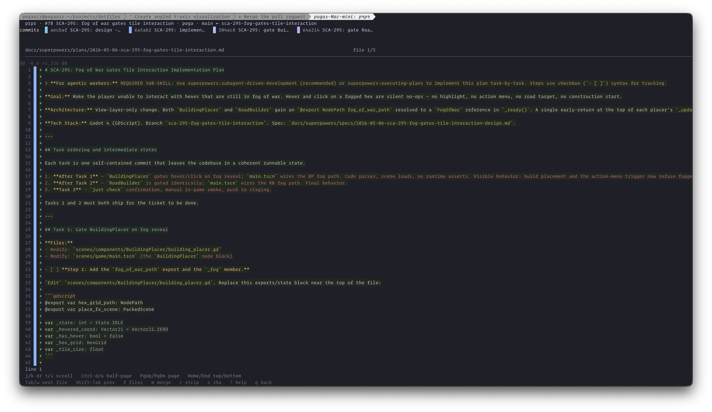
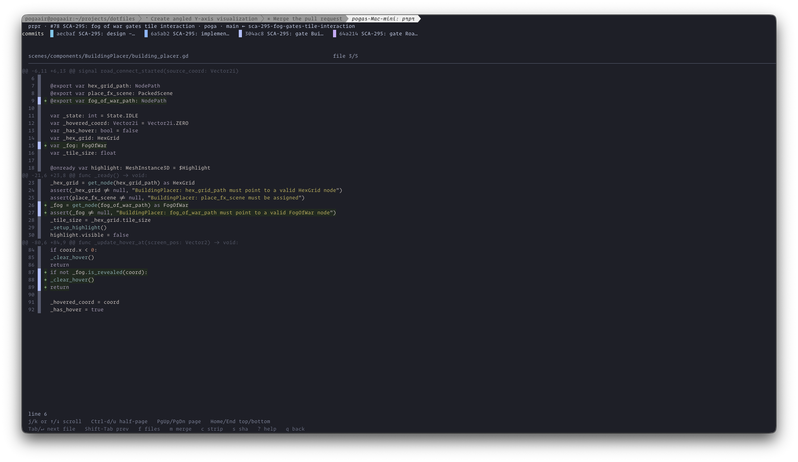

# prpr

A keyboard-driven TUI for reviewing GitHub PRs, with per-commit color
attribution in the diff.




## Requirements

- `gh` CLI on `$PATH`, authenticated (`gh auth login`)
- `git` on `$PATH`
- A truecolor-capable terminal (Kitty recommended)

## Install

```bash
cargo install --path .
```

## Run

From inside a clone of any GitHub-hosted repo:

```bash
prpr
```

Or from a folder that holds several clones side by side, to review the
open PRs of all of them in one list:

```bash
cd ~/projects
prpr --projects
```

Every direct child that is a git clone with a github.com remote counts.
Rows gain a repo column and are sorted by latest activity.

## Keys

Press `?` inside the app for the full keymap.
